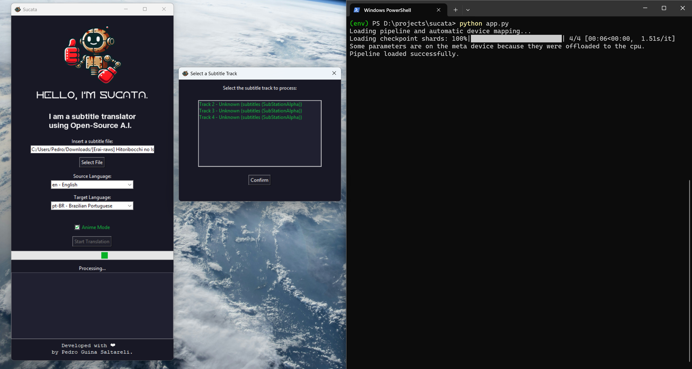

<p align="center">
    
</p>
<table align="center">
  <tr>
    <td align="center">
      <a href="readme-pt_BR.md">
        
      </a>
    </td>
    <td align="center">
      <a href="readme.md">
        
      </a>
    </td>
  </tr>
</table>

<h1 align="center">Olá, eu sou o SUCATA.</h1>
<p align="center">
	<em>Um tradutor de legendas que utiliza modelos de Inteligência Artificial Open-Source.</em>
</p>
<p align="center">
	
	
	
</p>

---

## 📖 Índice

- [Visão Geral](#-visão-geral)
- [Funcionalidades](#%EF%B8%8F-funcionalidades)
- [Estrutura do Projeto](#-estrutura-do-projeto)
- [Como Começar](#-como-começar)
  - [Pré-requisitos](#%EF%B8%8F-pré-requisitos)
  - [Instalação](#-instalação)
  - [Como Usar](#-como-usar)
- [Testes](#-testes)
- [Nota Importante](#-nota-importante)
- [Roadmap do Projeto](#-roadmap-do-projeto)
- [Contribuindo](#-contribuindo)
- [Licença](#-licença)
- [Agradecimentos](#-agradecimentos)

---

## 🌟 Visão Geral

**Sucata** é uma ferramenta open-source projetada para extrair e traduzir legendas de arquivos `.mkv`, além de processar diretamente arquivos `.srt`, `.ass` e `.ssa`. Com uma interface amigável, o Sucata utiliza **modelos de linguagem baseados em IA**, como Llama, para fornecer traduções de alta qualidade enquanto preserva o contexto e o estilo dos diálogos originais.




---

## ⚙️ Funcionalidades

- **Extração de Legendas**:
  - Compatível com faixas de legenda em arquivos MKV.
  - Seleção de faixas via GUI para melhor usabilidade.
  
- **Tradução Inteligente**:
  - Suporte a arquivos `.srt`, `.ass` e `.ssa`.
  - Adaptação contextual de gírias, expressões culturais e tons emocionais.

- **Interface Gráfica**:
  - Desenvolvida com `Tkinter`, oferece simplicidade e acessibilidade.

- **Suporte a Múltiplos Idiomas**:
  - Suporta diversos idiomas, incluindo *Árabe, Bengali, Chinês Mandarim, Coreano, Espanhol, Francês, Hindi, Inglês, Indonésio, Japonês, Marathi, Português, Português Brasileiro, Punjabi Ocidental, Russo, Tâmil, Telegu, Turco, Urdu e Vietnamita*.

---

## 📂 Estrutura do Projeto

```bash
└── sucata/
    ├── app.py                # Arquivo principal do projeto
    ├── fonts/                # Fontes utilizadas na interface
    │   ├── FKGroteskNeueTrial-Bold.otf
    │   ├── FKGroteskNeueTrial-Regular.otf
    │   └── Horizon.otf
    ├── img/                  # Imagens do projeto
    │   ├── sucata_hello.png
    │   ├── sucata_icon.ico
    │   ├── sucata_preview.jpeg
    │   └── kofi_pt-BR.png
    ├── requirements.txt      # Dependências do projeto
    └── README.md             # Readme universal
    └── README-pt-BR.md       # Este arquivo
```

---

## 🚀 Como Começar

### 🛠️ Pré-requisitos

- **Python**: Requer Python 3.9 ou superior.
- **Pip**: Gerenciador de pacotes do Python.
- **Ferramentas Externas**:
  - `mkvextract` e `mkvmerge` para manipulação de arquivos MKV.
- Conta na **Hugging Face** (opcional): Necessária para acessar alguns modelos de IA, como Llama.

### 📦 Instalação

1. **Clone o Repositório**:
   ```bash
   git clone https://github.com/pedronalis/sucata.git
   ```
2. **Acesse o Diretório**:
   ```bash
   cd sucata
   ```
3. **Instale as Dependências**:
   ```bash
   pip install -r requirements.txt
   ```

4. **Configure o Modelo (opcional)**:
   - Para usar **modelos Llama ou Qwen**, solicite acesso na [Hugging Face](https://huggingface.co/meta-llama).
   - Caso não tenha acesso, utilize um modelo alternativo open-source.

---

### 🪄 Como Usar

1. Execute o programa:
   ```bash
   python app.py
   ```
2. Na interface:
   - **Selecione um arquivo MKV ou de legenda (.srt/.ass/.ssa)**.
   - **Escolha o idioma de origem**.
   - Clique em **Iniciar Tradução** e acompanhe o progresso no log.

---

### 🧪 Testes

- **Básico**:
  - Utilize um pequeno arquivo `.srt` para testar as traduções.
- **Avançado**:
  - Teste com arquivos MKV contendo várias faixas de legenda.

---

## 📝 Nota Importante

Este programa **não substitui um tradutor profissional** e não garante traduções 100% perfeitas. Embora utilize modelos avançados de Inteligência Artificial, podem ocorrer erros ou inadequações contextuais em algumas traduções.

Para melhorar os resultados, você pode **personalizar o prompt** no arquivo `app.py` de acordo com o idioma e o estilo desejados. Isso pode ajudar a IA a produzir traduções mais adaptadas às suas necessidades.

---

## 📅 Roadmap do Projeto

- [x] **Lançamento Inicial**: Tradução de legendas e extração de faixas.
- [x] Implementar suporte para novos idiomas.
- [ ] Adicionar suporte para tradução em lote.
- [ ] Melhorar otimização de modelos com fine-tuning.

---

## 🤝 Contribuindo

- **Fork o Repositório** e faça suas melhorias!
- Envie um **Pull Request** com suas alterações.
- **Reporte Bugs** ou sugira melhorias.

<a href='https://ko-fi.com/pedronalis' target='_blank'></a>

---

## 📜 Licença

Este projeto é licenciado sob a [GNU AGPL](https://choosealicense.com/licenses/agpl-3.0/). 

Sinta-se à vontade para contribuir! ❤️

---

## 🙏 Agradecimentos

- **Hugging Face**: Pelo suporte aos modelos open-source.
- **Comunidade Tkinter**: Pela documentação acessível.
- Todos os contribuidores e testers que ajudam a melhorar o projeto.

---