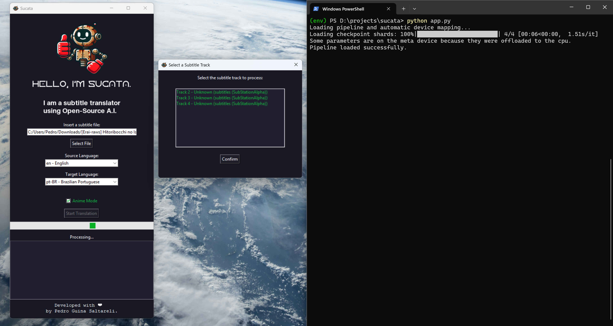
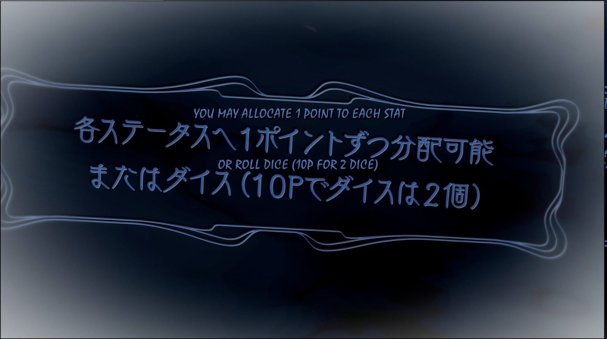
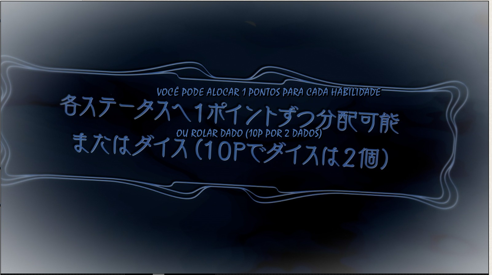

<p align="center">
    
</p>
<table align="center">
  <tr>
    <td align="center">
      <a href="readme-pt_BR.md" style="outline:none">
        
      </a>
    </td>
    <td align="center">
      <a href="readme.md" style="outline:none">
        
      </a>
    </td>
  </tr>
</table>
<h1 align="center">Hello, I'm SUCATA.</h1>
<p align="center">
	<em>A subtitle translator powered by Open-Source Artificial Intelligence models.</em>
</p>
<p align="center">
	
	
	
</p>

---

## 📖 Table of Contents

- [Overview](#-overview)
- [Features](#%EF%B8%8F-features)
- [Project Structure](#-project-structure)
- [Getting Started](#-getting-started)
  - [Prerequisites](#%EF%B8%8F-prerequisites)
  - [Installation](#-installation)
  - [Usage](#-usage)
- [Testing](#-testing)
- [Important Note](#-important-note)
- [Project Roadmap](#-project-roadmap)
- [Contributing](#-contributing)
- [License](#-license)
- [Acknowledgments](#-acknowledgments)

---

## 🌟 Overview

**Sucata** is an open-source tool designed to extract and translate subtitles from `.mkv` files, as well as process `.srt`, `.ass`, and `.ssa` subtitle files directly. Featuring a user-friendly interface, Sucata leverages **AI language models**, such as Llama, to deliver high-quality translations while preserving the context and style of the original dialogues.





---

## ⚙️ Features

- **Subtitle Extraction**:
  - Compatible with subtitle tracks in MKV files.
  - Track selection via GUI for enhanced usability.
  
- **Intelligent Translation**:
  - Support for `.srt`, `.ass`, and `.ssa` files.
  - Contextual adaptation of slang, cultural expressions, and emotional tones.

- **Graphical User Interface**:
  - Built with `Tkinter`, offering simplicity and accessibility.

- **Multi-Language Support**:
  - Supports multiple languages, including *Arabic, Bengali, English, French, German, Hindi, Indonesian, Japanese, Korean, Mandarin Chinese, Marathi, Portuguese, Brazilian Portuguese, Russian, Spanish, Tamil, Telugu, Turkish, Urdu, Vietnamese, and Western Punjabi.*

---

## 📂 Project Structure

```bash
└── sucata/
    ├── app.py                # Main project
    ├── fonts/                # Utilized fonts
    │   ├── FKGroteskNeueTrial-Bold.otf
    │   ├── FKGroteskNeueTrial-Regular.otf
    │   └── Horizon.otf
    ├── img/                  # Project images
    │   ├── sucata_hello.png
    │   ├── sucata_icon.ico
    │   ├── sucata_preview.jpeg
    │   └── kofi_pt-BR.png
    ├── requirements.txt      # Project dependencies
    └── README.md             # Universal Readme
    └── README-pt-BR.md       # Portuguese Brazilian Readme
```

---

## 🚀 Getting Started

### 🛠️ Prerequisites

- **Python**: Requires Python 3.9 or later.
- **Pip**: Python's package manager.
- **External Tools**:
  - `mkvextract` and `mkvmerge` for MKV file handling.
- A **Hugging Face** account (optional): Needed to access certain AI models like Llama.

### 📦 Installation

1. **Clone the Repository**:
   ```bash
   git clone https://github.com/pedronalis/sucata.git
   ```
2. **Navigate to the Directory**:
   ```bash
   cd sucata
   ```
3. **Install Dependencies**:
   ```bash
   pip install -r requirements.txt
   ```

4. **Configure the Model (Optional)**:
   - To use **Llama or Qwen Models**, request access from [Hugging Face](https://huggingface.co/meta-llama).
   - If you don’t have access, use an alternative open-source model.

---

### 🪄 Usage

1. Run the program:
   ```bash
   python app.py
   ```
2. In the interface:
   - **Select an MKV or subtitle file (.srt/.ass/.ssa)**.
   - **Choose the source language**.
   - Click **Start Translation** and monitor the progress in the log.

---

### 🧪 Testing

- **Basic**:
  - Use a small `.srt` file to test translations.
- **Advanced**:
  - Test with MKV files containing multiple subtitle tracks.

---
## 📝 Important Note

This program **does not replace a professional translator** and does not guarantee 100% perfect translations. While it uses advanced Artificial Intelligence models, errors or contextual inaccuracies may occur in some translations.

To improve results, you can **customize the prompt** inside the `app.py` file to fit your desired language and style. This can help the AI produce translations better tailored to your needs.

---

## 📅 Project Roadmap

- [x] **Initial Release**: Subtitle translation and track extraction.
- [x] Implement support for additional languages.
- [ ] Add support for batch translations.
- [ ] Improve model optimization with fine-tuning.

---

## 🤝 Contributing

- **Fork the Repository** and make your improvements!
- Submit a **Pull Request** with your changes.
- **Report Bugs** or suggest enhancements.

<a href='https://ko-fi.com/pedronalis' target='_blank'></a>

---

## 📜 License

This project is licensed under the [GNU AGPL](https://choosealicense.com/licenses/agpl-3.0/). 

Feel free to contribute! ❤️

---

## 🙏 Acknowledgments

- **Hugging Face**: For supporting open-source models.
- **Tkinter Community**: For accessible documentation.
- All contributors and testers helping to improve the project.

---