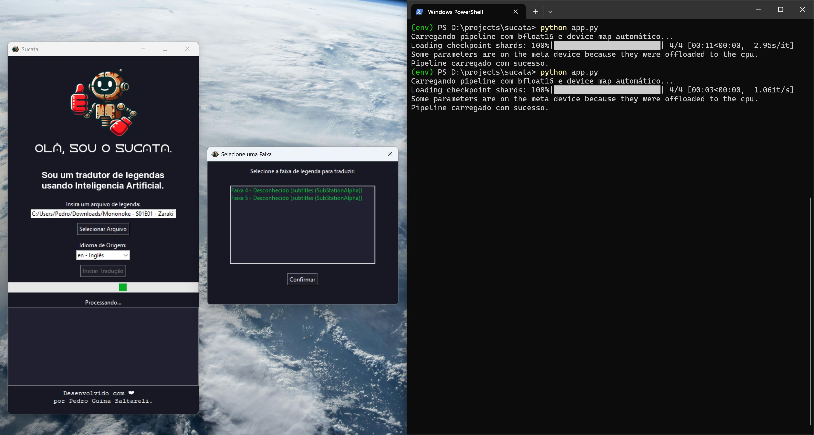

---

<p align="center">
    
</p>
<h1 align="center">Olá, eu sou o SUCATA.</h1>
<p align="center">
	<em>Um tradutor de legendas que utiliza modelos de Inteligência Artificial Open-Source.</em>
</p>
<p align="center">
	
	
	
</p>

---

## 📖 Sumário

- [Visão Geral](#-visão-geral)
- [Funcionalidades](#%EF%B8%8F-funcionalidades)
- [Estrutura do Projeto](#-estrutura-do-projeto)
- [Como Começar](#-como-começar)
  - [Pré-requisitos](#%EF%B8%8F-pré-requisitos)
  - [Instalação](#-instalação)
  - [Como Usar](#-como-usar)
- [Testando](#-testando)
- [Roadmap do Projeto](#-roadmap-do-projeto)
- [Contribuindo](#-contribuindo)
- [Licença](#-licença)
- [Agradecimentos](#-agradecimentos)

---

## 🌟 Visão Geral

**Sucata** é uma ferramenta open-source projetada para extrair e traduzir legendas de arquivos MKV, além de processar diretamente arquivos `.srt`, `.ass` e `.ssa`. Com uma interface amigável, o Sucata utiliza **modelos de linguagem baseados em IA**, como o Llama, para fornecer traduções de alta qualidade, preservando o contexto e o estilo das falas originais.



---

## ⚙️ Funcionalidades

- **Extração de Legendas**:
  - Compatível com faixas de legendas em arquivos MKV.
  - Seleção de faixas via GUI para melhor usabilidade.
  
- **Tradução Inteligente**:
  - Suporte a arquivos `.srt`, `.ass` e `.ssa`.
  - Adaptação contextual de gírias, expressões culturais e tons emocionais.

- **Interface Gráfica**:
  - Desenvolvida com `Tkinter`, proporciona simplicidade e acessibilidade para usuários.

- **Compatibilidade**:
  - Suporte para múltiplos idiomas, incluindo inglês, espanhol, francês, japonês, e mais.

---

## 📂 Estrutura do Projeto

```bash
└── sucata/
    ├── app.py                # Arquivo principal do projeto
    ├── fonts/                # Fontes utilizadas na interface
    │   ├── FKGroteskNeueTrial-Bold.otf
    │   ├── FKGroteskNeueTrial-Regular.otf
    │   └── Horizon.otf
    ├── img/                  # Imagens do projeto
    │   ├── sucata_hello.png
    │   └── sucata_icon.ico
    ├── requirements.txt      # Dependências do projeto
    └── README.md             # Este arquivo
```

---

## 🚀 Como Começar

### 🛠️ Pré-requisitos

- **Python**: Requerido o Python 3.9 ou superior.
- **Pip**: Gerenciador de pacotes do Python.
- **Ferramentas Externas**:
  - `mkvextract` e `mkvmerge` para manipulação de arquivos MKV.
- Conta na **Hugging Face** (opcional): Necessária para acessar alguns modelos de IA, como o Llama.

### 📦 Instalação

1. **Clone o Repositório**:
   ```bash
   git clone https://github.com/pedronalis/sucata.git
   ```
2. **Acesse o Diretório**:
   ```bash
   cd sucata
   ```
3. **Instale as Dependências**:
   ```bash
   pip install -r requirements.txt
   ```

4. **Configure o Modelo (opcional)**:
   - Para usar o **Llama 3.1**, solicite acesso na [Hugging Face](https://huggingface.co/meta-llama).
   - Caso não tenha acesso, utilize um modelo alternativo open-source.

---

### 🪄 Como Usar

1. Execute o programa:
   ```bash
   python app.py
   ```
2. Na interface:
   - **Selecione um arquivo MKV ou de legenda (.srt/.ass/.ssa)**.
   - **Escolha o idioma de origem**.
   - Clique em **Iniciar Tradução** e acompanhe o progresso no log.

---

### 🧪 Testando

- **Simples**:
  - Utilize um pequeno arquivo `.srt` para verificar a tradução.
- **Avançado**:
  - Teste com arquivos MKV com múltiplas faixas de legendas.

---

## 📅 Roadmap do Projeto

- [x] **Versão Inicial**: Tradução de legendas e extração de faixas.
- [ ] Adicionar suporte para tradução em lote.
- [ ] Melhorar otimização de modelos com fine-tuning.
- [ ] Implementar suporte a novos idiomas.

---

## 🤝 Contribuindo

- **Fork o Repositório** e faça suas melhorias!
- Envie um **Pull Request** com suas mudanças.
- **Reporte Bugs** ou sugira melhorias.

<script type='text/javascript' src='https://storage.ko-fi.com/cdn/widget/Widget_2.js'></script><script type='text/javascript'>kofiwidget2.init('Pague-me um café', '#030303', 'J3J616MCB2');kofiwidget2.draw();</script>

---

## 📜 Licença

Este projeto é protegido pela licença [GNU AGPL](https://choosealicense.com/licenses/agpl-3.0/). 

Sinta-se livre para contribuir!❤️


---

## 🙏 Agradecimentos

- **Hugging Face**: Pelo suporte aos modelos open-source.
- **Tkinter Community**: Pela documentação acessível.
- Todos os contribuidores e testers que ajudam a melhorar o projeto.

---
